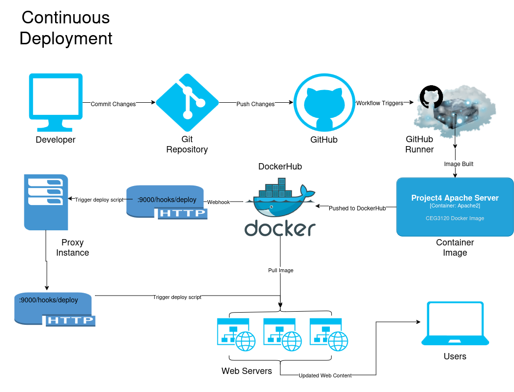

# Bonus Project
Robert D'Allessandris  
CEG3120  
Spring 2024  

## Overview  

This project returns to the load balancing project from earlier this semester and aims to update it to utilize continuous deployment. 

When a tagged version update is pushed to GitHub a workflow is triggered as defined in the `.github/workflows` directory of the repository. The workflow utilizes a GitHub Runner to checkout the repository, gather the tag meta-data, log into DockerHub, then build and push the image to DockerHub. When DockerHub receives the push a webhook is triggered, sending an http request to port 9000 at the public IP address of the AWS proxy server. 

When the proxy server recieves the webhook it triggers the `proxy deploy script`, which in turn uses `curl` to send http requests to port 9000 at the private IP addresses of the AWS webservers. The webservers, upon receipt of these webhooks, trigger their own `webserv deploy scripts`. These scripts stop and delete the currently running container, pull the fresh image from DockerHub through the NAT gateway, then run a new container serving updated web content.  

  

## Implementation

[AWS CloudFormation Docs](https://docs.aws.amazon.com/AWSCloudFormation/latest/UserGuide/Welcome.html)

The entirety of this setup is created through the use of an AWS CloudFormation Template. The template is an amalgamation of the Project 5 CF template and the Project 3 load balancing CF template. It will create all the resources necessary for the VPC, subnets, proxy instance and three web server instances. HAproxy is installed on the proxy server. Docker is installed on each web server. Webhook is installed on both the proxy and web servers. Each instance is automatically configured to start serving the load balanced web content and receiving webhooks to update with no need to log into the instances at all.   

The only thing that has not been automated is the proxy server needs the private key (`vockey.pem`) to ssh into the web servers manually sftp'd onto it. This is only necessary if you need to manually ssh into those servers. The setup works fine without the need for manual configuration. This could have been automated as well with the use of AWS secrets, but due to time contraints and being outside of the scope of the project this was not implemented. However, the ssh config file is configured already so all that is needed is the key uploaded into /home/ubuntu/.ssh.

## Scripts and config files

#### Proxy deploy script
location: /home/ubuntu/deploy.sh

```bash
#! /bin/bash

curl 172.18.1.10:9000/hooks/deploy
curl 172.18.1.20:9000/hooks/deploy
curl 172.18.1.30:9000/hooks/deploy
```

#### Proxy Hook Definition file
location: /etc/webhook.conf

```json
[
    {
    "id": "deploy",
    "execute-command": "/home/ubuntu/deploy.sh",
    "command-working-directory": "/home/ubuntu"
    }
]
```

#### Web Server deploy script
location: /home/ubuntu/deploy.sh

```bash
#! /bin/bash

# Kill and delete old container process
docker stop webserv
docker system prune --force
# pull fresh image
docker pull rdalless/ceg3120:latest
# run new container
docker run -d -p 80:80 --name webserv --restart always rdalless/ceg3120:latest
```

#### Web Server Hook Definition file
location: /etc/webhook.conf

```bash
[
    {
    "id": "deploy",
    "execute-command": "/home/ubuntu/deploy.sh",
    "command-working-directory": "/home/ubuntu"
    }
]
```
