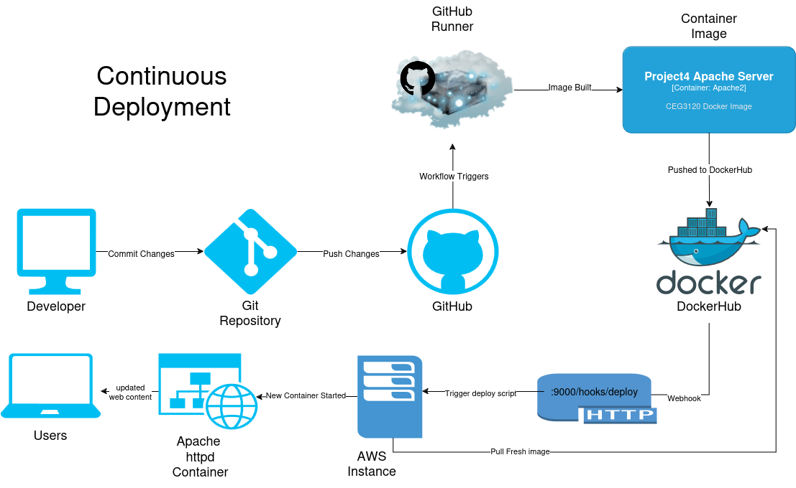
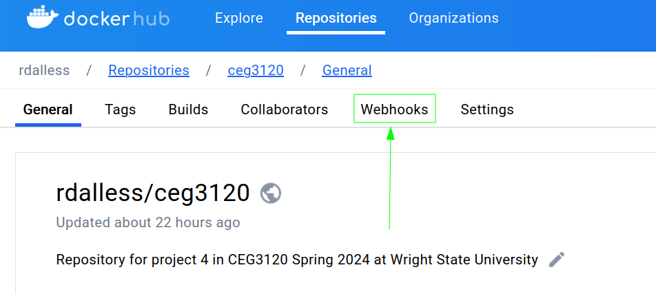
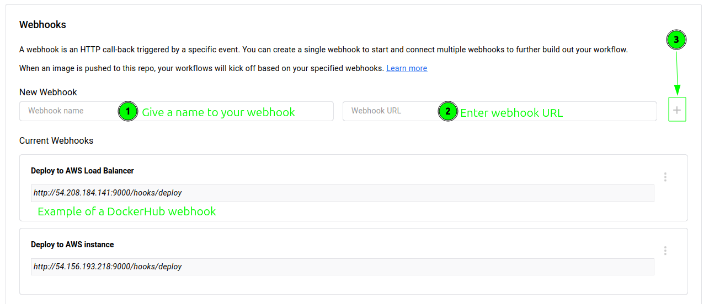

# Project 5: Continuous Deployment
Robert D'Allessandris  
CEG 3120  
Spring 2024  

## Project Overview  

This project demonstrates the continuous deployment of a Docker image. The image for this project is an `apache2 httpd` server that will be automatically pushed to DockerHub with correct semantic versioning when a new version tag is pushed to GitHub. This is accomplished using GitHub actions as defined in the `.github/workflows` directory. The workflow uses a GitHub runner to build the image and push it to DockerHub. When DockerHub receives the push, a webhook is triggered which will send an http request to an AWS instance. When the instance recieves this webhook, a deployment script is run. The script stops and deletes the currently running container, pulls the fresh image from DockerHub, then starts a new container. Now updated web content is being served from the container on the instance.



## 1. Semantic Versioning  

[Semantic Versioning](https://semver.org/)  
[Github Actions - Docker metadata](https://github.com/docker/metadata-action)  
[Docker Docs - Manage tags/labels with GitHub actions](https://docs.docker.com/build/ci/github-actions/manage-tags-labels/)  
[Git Tagging](https://git-scm.com/book/en/v2/Git-Basics-Tagging)  

### How to generate a tag in git / GitHub

A lightweight tag is simply:  
```bash
git tag v1.0
```  
  
To generate an annotated tag:  
```bash
git tag -a v1.1 -m "Release version 1.1"
```  
Annotated tags store additional information such as tagger name, email, date and a message.  

Tags do not get automatically pushed up to GitHub. To push a tag:  
```bash
git push origin v1.0
```  

### Amend GitHub Action workflow to push Docker images with tags

1. To change the GitHub Action workflow to trigger when a tag is pushed, amend the workflow trigger in the yaml file as follows:  

    ```yaml
    on:
    push:
        tags:
        - 'v*'
    ```  
    
    This will cause the workflow to trigger only when a tag is pushed.  
  
2. To Generate tags for the DockerHub image we will use the `docker/metadata-action` GitHub Action. Add the following to the steps section of the workflow yaml:  
  
    ```yaml
    - 
        name: Docker meta
        id: meta
        uses: docker/metadata-action@v5
        with:
            images: |
                rdalless/ceg3120
            tags: |
            type=ref,event=tag
            type=semver,pattern=v{{major}}.{{minor}}
            type=semver,pattern=v{{major}}
    ```  
    
    This will collect the github tag metadata that we will use when pushing the image to DockerHub.  
  
3. Modify the build and push action to utilize these tags:  
  
    ```yaml
    -
        name: Build and push Docker images
        uses: docker/build-push-action@v5.3.0
        with:
            push: true
            tags: ${{ steps.meta.outputs.tags }}
            labels: ${{ steps.meta.outputs.labels }}
    ```  

### Behavior of GitHub workflow
[My DockerHub Repository Link](https://hub.docker.com/repository/docker/rdalless/ceg3120/general)

This workflow will when a tag is pushed to GitHub. 
1. actions/checkout@v4 checks out the git repository so the workflow can access it.
1. docker/meta-action grabs the git tag metadata. 
2. docker/login-action logs into my dockerhub account using the GitHub secrets variables. 
3. docker/build-push-action builds the image and pushes it to DockerHub with the version tag (e.g. v1.1) and latest.

## 2. Deployment  

[GitHub Actions & webhooks](https://levelup.gitconnected.com/automated-deployment-using-docker-github-actions-and-webhooks-54018fc12e32)  
[DockerHub & webhooks](https://blog.devgenius.io/build-your-first-ci-cd-pipeline-using-docker-github-actions-and-webhooks-while-creating-your-own-da783110e151)  

This [Cload Formation Template](./project5-cf.yml) automates creating an instance with docker installed, the docker image downloaded from dockerhub, a new container started, and the webhooks properly configured to trigger a pre-loaded deploy script.  

I will walk through setting this up manually below.  

### How to install Docker to your instance

Please refer to [README-CI](./README-CI.md#how-to-install-docker--dependencies) for step-by-step instructions to installing docker on a linux instance.  

### Container restart script

```bash
#! /bin/bash

# Kill and delete old container process
docker stop webserv
docker system prune --force
# pull fresh image
docker pull rdalless/ceg3120:latest
# run new container
docker run -d -p 80:80 --name webserv --restart always rdalless/ceg3120:latest
```

The deploy script is called by webhook when DockerHub is pushed an new image. The script will stop and delete the currently running container, download the fresh image, then start a new container with the --restart flag ensuring it runs whenever the system is rebooted.  
  
The script is located in `/home/user/ubuntu/deploy.sh` 

### Setting up a webhook on the instance

[Adnanh webhook](https://github.com/adnanh/webhook)

On an ubuntu instance, webhook can simply be installed with `sudo apt install webhook`

> [!CAUTION]  
> Webhook listens on port 9000. Make sure security groups are configured properly

To start webhook manually: 
1. First you need to know the path were webhook is installed. Use `which webhook` to find this. In my case it is located at `/usr/bin/webhook`. 
2. Next make sure you have your hooks definition file. I used the default file name and location that the webhook service expects `/etc/webhook.conf`.
    - See below for my hook file or reference the official documentation for how to configure it to your own purposes
3. Run webhook with `/usr/bin/webhook -hooks /etc/webhook.conf -verbose`

To configure the service to work on boot: 

1. reference the service file at `/lib/systemd/system/webhook.service`:  

    ```bash
    [Unit]
    Description=Small server for creating HTTP endpoints (hooks)
    Documentation=https://github.com/adnanh/webhook/
    ConditionPathExists=/etc/webhook.conf

    [Service]
    ExecStart=/usr/bin/webhook -nopanic -hooks /etc/webhook.conf

    [Install]
    WantedBy=multi-user.target
    ```
    The service is looking for `/etc/webhook.conf` on startup by default. This is the hooks definitions file for the service. 

    **NOTE:** you could change this if you prefer to have the hooks file named something else like hooks.json, or have it in a different location. Simply change the file in both ConditionPathExists and ExecStart. If you do this then you must `sudo systemctl daemon-reload` followed by `sudo systemctl restart webhook.service` for the changes to take effect. 

2. Create the hook definition file `/etc/webhook.conf`:  
    ```json
    [
        {
        "id": "deploy",
        "execute-command": "/home/ubuntu/deploy.sh",
        "command-working-directory": "/home/ubuntu"
        }
    ]
    ``` 

3. The service will now start automatically on boot

To trigger the webhook:

- webhook listens on `port 9000`. The following http request will trigger the webhook:  

    `http://54.156.193.218:9000/hooks/deploy`  

- Upon recieving the http request and matching the `"id": "deploy"` defined in webhooks.conf, it will execute the script defined in `"execute-command": "/home/ubuntu/deploy.sh"`

- deploy.sh is the [container restart script](#container-restart-script) defined above.


### How to configure DockerHub to message the listener

1. On the your repository page click on webhooks  
      

2. Give the webhook a name, enter the url `http://54.156.218:9000/hooks/deploy`, then click the plus to add it.
    

When DockerHub receives a push to the repository it will send out the http request, triggering the webhook on the instance to run the deploy script.

### Provide proof that the CI & CD workflow work

Proof was demonstrated in person

### Additional Resources 

[Stackoverflow - Cloudformation logging user-data](https://stackoverflow.com/questions/54906764/aws-cloudformation-userdata-issue)  
[Stackoverflow - Echo multiline string into file bash](https://stackoverflow.com/questions/39277019/echo-multiline-string-into-file-bash)  
[Linuxize - HereDoc](https://linuxize.com/post/bash-heredoc/)  

