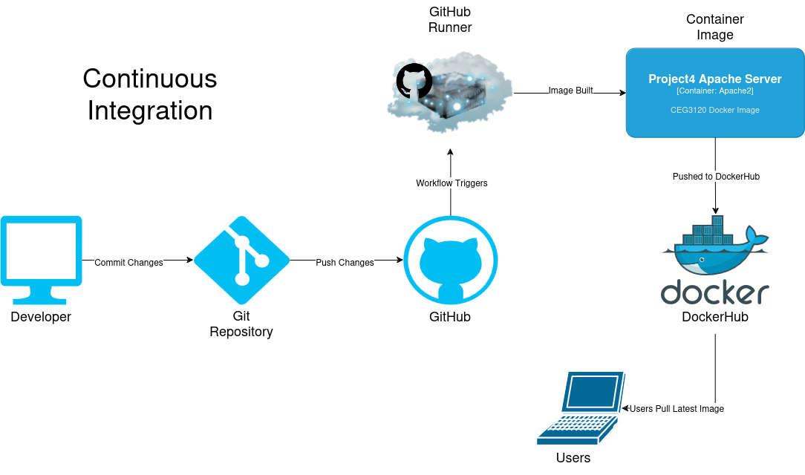
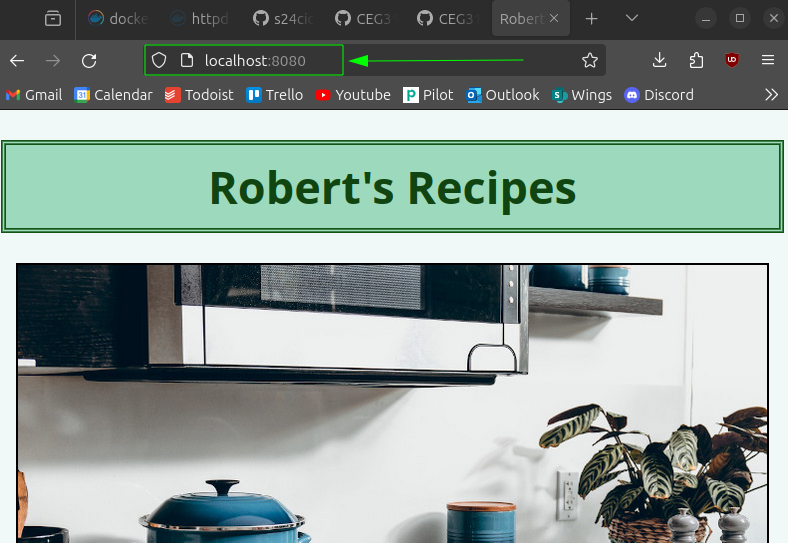
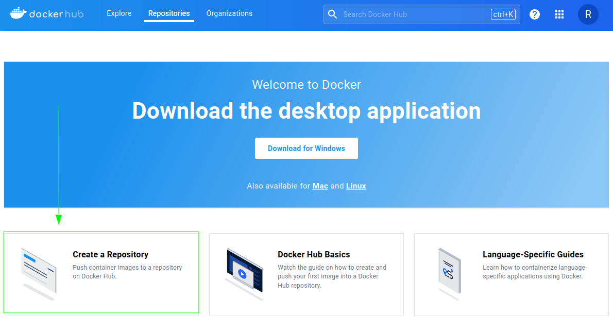
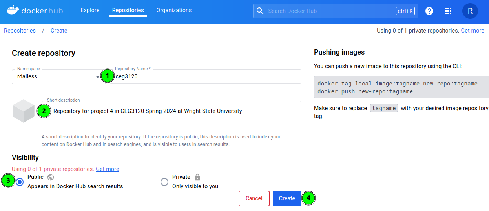
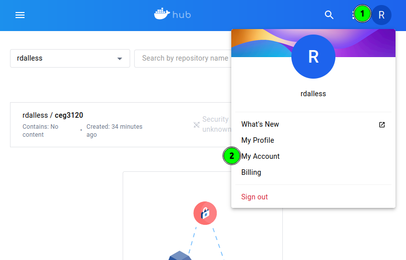
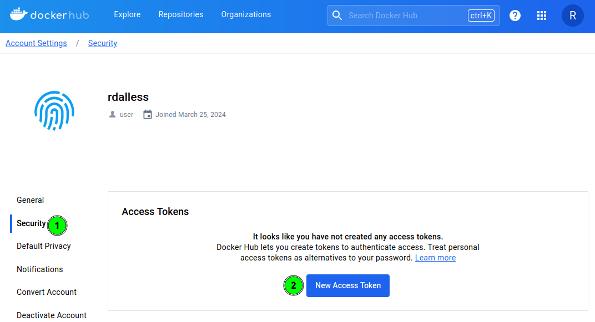
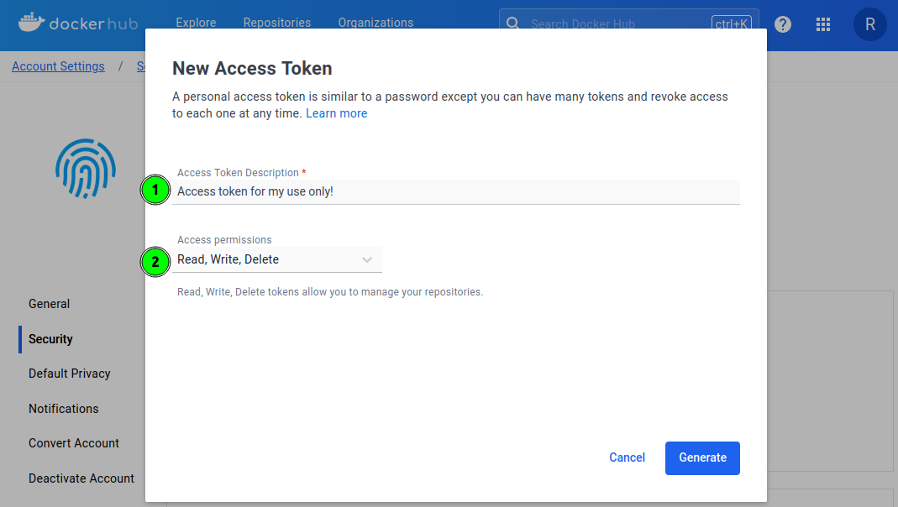

# Project 4: CI -> CD  
Robert D'Allessandris  
CEG 3120  
Spring 2024  

## CI Project Overview 
  
The Goal of this project is to run a webserver within a Docker container. The intructions below walk through installing the Docker engine, creating a dockerfile and docker image, then using that image to create a container that runs the httpd webserver. The [Apache HTTP Server](https://hub.docker.com/_/httpd) makes it very straightforward to set up a simple html server. 

### Diagram of Continuous Integration


## 1. Dockerize It
  
### How to install docker + dependencies  

Instructions for installing the `Docker Engine` are in the [Docker Docs](https://docs.docker.com/engine/install/ubuntu/#install-using-the-repository)
- *Note: These instructions were run on Ubuntu 23.10*
- You may find references to an apt package named docker.io which is unofficial. It may be installed simply with `sudo apt install docker.io`. However your best bet would be to follow the official installation instructions on the Docker Docs for the most up to date version and official support.
    - If you have previously installed unofficial versions of Docker run the following command first:

    ```bash
    for pkg in docker.io docker-doc docker-compose docker-compose-v2 podman-docker containerd runc; do sudo apt-get remove $pkg; done
    ```

Set up Docker's apt repository:
```bash
# Add Docker's official GPG key:
sudo apt-get update
sudo apt-get install ca-certificates curl
sudo install -m 0755 -d /etc/apt/keyrings
sudo curl -fsSL https://download.docker.com/linux/ubuntu/gpg -o /etc/apt/keyrings/docker.asc
sudo chmod a+r /etc/apt/keyrings/docker.asc

# Add the repository to Apt sources:
echo \
  "deb [arch=$(dpkg --print-architecture) signed-by=/etc/apt/keyrings/docker.asc] https://download.docker.com/linux/ubuntu \
  $(. /etc/os-release && echo "$VERSION_CODENAME") stable" | \
  sudo tee /etc/apt/sources.list.d/docker.list > /dev/null
sudo apt-get update
```  

To install the latest version:

```bash
sudo apt-get install docker-ce docker-ce-cli containerd.io docker-buildx-plugin docker-compose-plugin
```

Test that everything worked with:  
```bash
sudo docker run hello-world
```

After installing the Docker Engine, Follow these [instructions](https://docs.docker.com/desktop/install/ubuntu/) to install `Docker Desktop`
- This is unnecessary; Everything can be done in the command line version installed above.
- If you are trying to install Docker Desktop and get the following error:
    ```
    The following packages have unmet dependencies:
    docker-desktop : Depends: docker-ce-cli but it is not installable
    E: Unable to correct problems, you have held broken packages.
    ```
    It means you have not installed the Docker Engine yet  
### How to build an image from the Dockerfile

[Docker Docs - build image](https://docs.docker.com/reference/cli/docker/image/build/)  
[Docker Hub - httpd](https://hub.docker.com/_/httpd)

The docker file is simply:
```docker
FROM httpd:2.4

COPY ./website/ /usr/local/apache2/htdocs/
```
- The httpd documentation on Docker Hub states that all html content must be copied into `/usr/local/apache2/htdocs/`  

Run the following command to build the image: 
```bash
docker build -t project4-apache-server .
```
  
### How to run the container  

[Docker Docs - run container](https://docs.docker.com/reference/cli/docker/container/run/)  

Run the following command to run a container from the image:
```bash
docker run -dit --name webserver1 -p 8080:80 project4-apache-server
```
- -d or --detach starts the container as a background process
    - since the container is detached you may interact with it by executing: 
    ```bash
    docker exec -it webserver1 bash
    ```
- -it allows you to interact with the container through the terminal
- -p or --expose binds the a port on local host to a port on the container
    - In this case port 8080 on localhost to port 80 of the container

You can stop the container with:
```bash
docker stop webserver1
```

To restart a stopped container:
```bash
docker start webserver1
```

### How to view the project running in the container
To view all containers:
```bash
docker ps -a
```
The status shows the uptime of the container  
  

To view the website running in the container open a browser and enter `http://localhost:8080/` into the search bar  
  




## 2. GitHub Actions & DockerHub  

### Creating a public repo in DockerHub

[Docker Docs - create account](https://docs.docker.com/docker-id/)  
[Docker Docs - create repository](https://docs.docker.com/docker-hub/repos/create/)  

In [DockerHub](https://hub.docker.com/), click on `Create a Repository`  


Next on the Create Repository page: 
1. Give your repository a name
2. Give it a short description
3. Select public visibility
4. Click create

  
  
You now have now created a public repository!

### Authenticate with DockerHub via CLI using Dockerhub credentials  
[Docker Docs - docker login](https://docs.docker.com/reference/cli/docker/login/)  
[Docker Docs - access tokens](https://docs.docker.com/security/for-developers/access-tokens/)  

You can log into docker from the command line with:  

```bash
docker login --username foo --password bar
```  

Alternatively, you can create a `personal access token` to use instead of password authentication:  

1. Click on your avatar and select `My Account` from the drop down menu  
  

2. Select `Security` from the sidebar then click `New Access Token`
  

3. Give the token a description, set the access permissions then click `Generate`
  
  

> [!WARNING]  
> Copy the generated access token immediately! It will not be displayed again.  
  
I would recommend setting up a token as that can be easily revoked if there is an issue or any suspicious activity is detected.  

### Push container image to Dockerhub (without GitHub Actions)  
[Docker Docs - Sharing image](https://docs.docker.com/get-started/04_sharing_app/)

To push your image to dockerhub first you need to login to your account:  
  
```bash
docker login -u rdalless
```  
When asked for a password, enter the token you just generated.  
  
Next you need to tag the image with the repostitory you are uploading too:  
  
```bash
docker tag project4-apache-server rdalless/ceg3120
```  
  
Now you can push the image to DockerHub:  
  
```bash
docker push rdalless/ceg3120:latest
```  
  

### Link to your DockerHub repository
https://hub.docker.com/repository/docker/rdalless/ceg3120/general  

### Configuring GitHub Secrets
[Github Docs - Secrets in github actions](https://docs.github.com/en/actions/security-guides/using-secrets-in-github-actions)  

#### How to set a secret

1. Click `Settings` on your repositories main page

2. Select, in the left sidebar, `Security` -> `Secrets and variables` -> `Actions`

3. Click `New Repository Secret`

4. Enter a name and the secret then click `Add secret`

#### What secret(s) are set for this project

A repository secret containing the Dockerhub token generated above and our Dockerhub username.  

### Behavior of GitHub workflow
[Docker Docs - Github Actions](https://docs.docker.com/build/ci/github-actions/)  
[Github Docs - Using Workflows](https://docs.github.com/en/actions/using-workflows)  

From the github marketplace we are using the [build and push docker images](https://github.com/marketplace/actions/build-and-push-docker-images) workflow. Create a `.github/workflows/publish-docker-image.yml` inside your repository.  
  
From the action documentation copy the following into the yaml file:

```yaml
name: ci

on:
  push:
    branches:
      - 'main'

jobs:
  docker:
    runs-on: ubuntu-latest
    steps:
      -
        name: Set up QEMU
        uses: docker/setup-qemu-action@v3
      -
        name: Set up Docker Buildx
        uses: docker/setup-buildx-action@v3
      -
        name: Login to Docker Hub
        uses: docker/login-action@v3
        with:
          username: ${{ secrets.DOCKERHUB_USERNAME }}
          password: ${{ secrets.DOCKERHUB_TOKEN }}
      -
        name: Build and push
        uses: docker/build-push-action@v5
        with:
          push: true
          tags: user/app:latest
```  

Some variables need to be updated from this template. first update the build-push-action to the latest version from the marketplace page. Next replace user/app:latest with your dokerhub repositories name. Finally, i will change DOKERHUB_TOKEN to DOCKER_PASSWORD and DOCKERHUB_USERNAME to DOCKER_USERNAME since that is what I named my secrets. The yaml file now look like this:  

```yaml
name: ci

on:
  push:
    branches:
      - 'main'

jobs:
  docker:
    runs-on: ubuntu-latest
    steps:
      -
        name: Set up QEMU
        uses: docker/setup-qemu-action@v3
      -
        name: Set up Docker Buildx
        uses: docker/setup-buildx-action@v3
      -
        name: Login to Docker Hub
        uses: docker/login-action@v3
        with:
          username: ${{ secrets.DOCKER_USERNAME }}
          password: ${{ secrets.DOCKER_PASSWORD }}
      -
        name: Build and push Docker images
        uses: docker/build-push-action@v5.3.0
        with:
          push: true
          tags: rdalless/ceg3120:latest
```

This workflow triggers on a push to the main branch of this github repository. It builds the image on a github runner then pushes it to the specified DockerHub repository if successful. 


### Resources

- [Docker Docs - CICD with GitHub Actions](https://docs.docker.com/ci-cd/github-actions/)
- [GitHub Actions - build-push-action documentation](https://github.com/marketplace/actions/build-and-push-docker-images)
- [GitHub - publishing images to DockerHub](https://docs.github.com/en/actions/guides/publishing-docker-images#publishing-images-to-docker-hub)