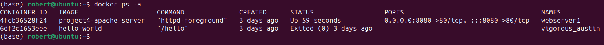

# Project 4: CI -> CD  
Robert D'Allessandris  
CEG 3120  
Spring 2024  

## CI Project Overview 
  
What are you doing, why, and what tools?  

## Run Project Locally  
  
### How to install docker + dependencies  

Instructions for installing the `Docker Engine` are in the [Docker Docs](https://docs.docker.com/engine/install/ubuntu/#install-using-the-repository)
- *Note: These instructions were run on Ubuntu 23.10*
- You may find references to an apt package named docker.io which is unofficial. It may be installed simply with `sudo apt install docker.io`. However your best bet would be to follow the official installation instructions on the Docker Docs for the most up to date version and official support.
    - If you have previously installed unofficial versions of Docker run the following command first:

    ```bash
    for pkg in docker.io docker-doc docker-compose docker-compose-v2 podman-docker containerd runc; do sudo apt-get remove $pkg; done
    ```

Set up Docker's apt repository:
```bash
# Add Docker's official GPG key:
sudo apt-get update
sudo apt-get install ca-certificates curl
sudo install -m 0755 -d /etc/apt/keyrings
sudo curl -fsSL https://download.docker.com/linux/ubuntu/gpg -o /etc/apt/keyrings/docker.asc
sudo chmod a+r /etc/apt/keyrings/docker.asc

# Add the repository to Apt sources:
echo \
  "deb [arch=$(dpkg --print-architecture) signed-by=/etc/apt/keyrings/docker.asc] https://download.docker.com/linux/ubuntu \
  $(. /etc/os-release && echo "$VERSION_CODENAME") stable" | \
  sudo tee /etc/apt/sources.list.d/docker.list > /dev/null
sudo apt-get update
```  

To install the latest version:

```bash
sudo apt-get install docker-ce docker-ce-cli containerd.io docker-buildx-plugin docker-compose-plugin
```

Test that everything worked with:  
```bash
sudo docker run hello-world
```

After installing the Docker Engine, Follow these [instructions](https://docs.docker.com/desktop/install/ubuntu/) to install `Docker Desktop`
- This is unnecessary; Everything can be done in the command line version installed above.
- If you are trying to install Docker Desktop and get the following error:
    ```
    The following packages have unmet dependencies:
    docker-desktop : Depends: docker-ce-cli but it is not installable
    E: Unable to correct problems, you have held broken packages.
    ```
    It means you have not installed the Docker Engine yet  
### How to build an image from the Dockerfile

[Docker Docs - build image](https://docs.docker.com/reference/cli/docker/image/build/)  
[Docker Hub - httpd](https://hub.docker.com/_/httpd)

The docker file is simply:
```docker
FROM httpd:2.4

COPY ./website/ /usr/local/apache2/htdocs/
```
- The httpd documentation on Docker Hub states that all html content must be copied into `/usr/local/apache2/htdocs/`  

Run the following command to build the image: 
```bash
docker build -t project4-apache-server .
```
  
### How to run the container  

[Docker Docs - run container](https://docs.docker.com/reference/cli/docker/container/run/)  

Run the following command to run a container from the image:
```bash
docker run -dit --name webserver1 -p 8080:80 project4-apache-server
```
- -d or --detach starts the container as a background process
    - since the container is detached you may interact with it by executing: 
    ```bash
    docker exec -it webserver1 bash
    ```
- -it allows you to interact with the container through the terminal
- -p or --expose binds the a port on local host to a port on the container
    - In this case port 8080 on localhost to port 80 of the container

You can stop the container with:
```bash
docker stop webserver1
```

To restart a stopped container:
```bash
docker start webserver1
```

### How to view the project running in the container
To view all containers:
```bash
docker ps -a
```
The status shows the uptime of the container  
  

To view the website running in the container open a browser and enter `http://localhost:8080/` into the search bar  
  


